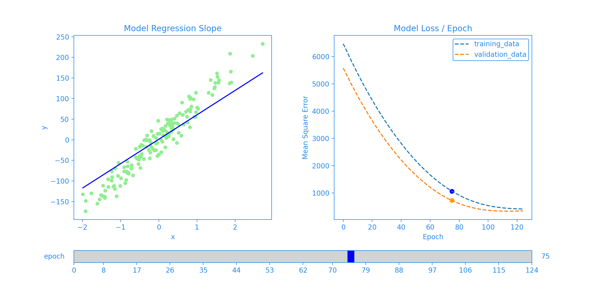

<!--Open Preview (Ctrl+Shift+V)-->
# Regression Artificial Neural Network :

## Table of Contents
* [Description](#description-)
* [Dependencies](#dependencies-)

## Description :
predict an output (numeric) variable as a function of the inputs independent features (categorical or numeric) with visualizing each epoch.

*Figure1 created using* `Plot_Regression`

## Dependencies :
* [Numpy](http://www.numpy.org/)
* [Matplotlib](https://matplotlib.org/)
* [scikit-learn](https://scikit-learn.org/stable/)
* [keras](https://keras.io/about/)

